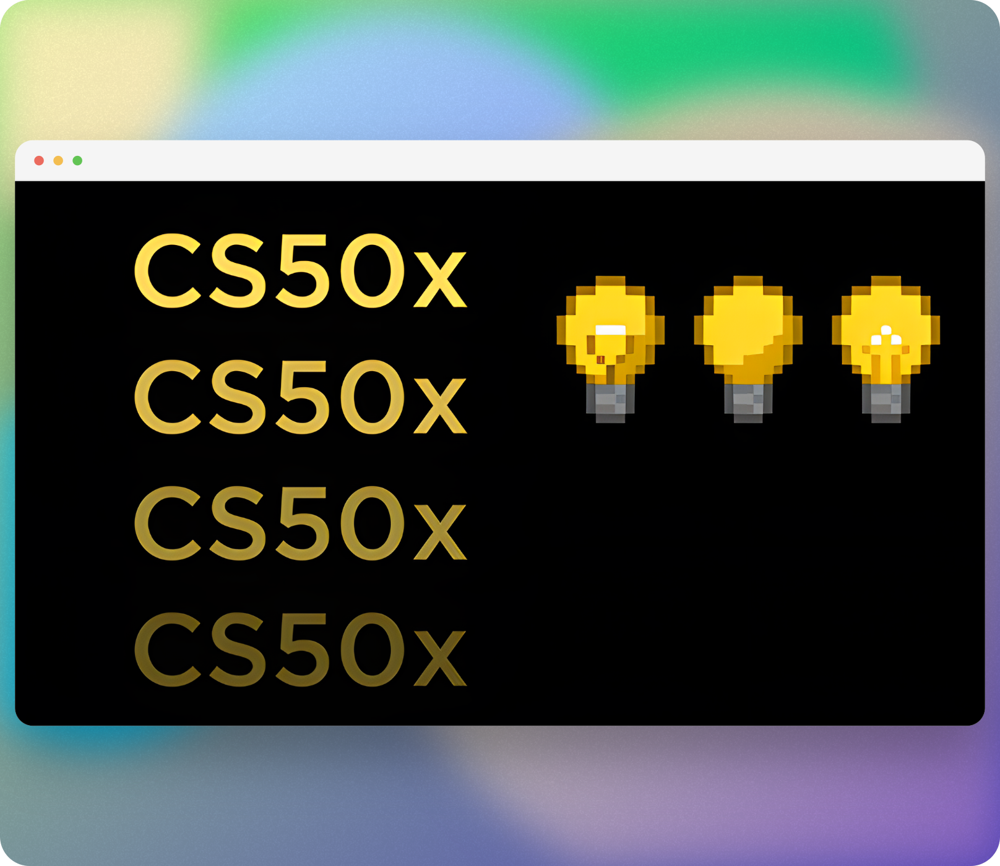
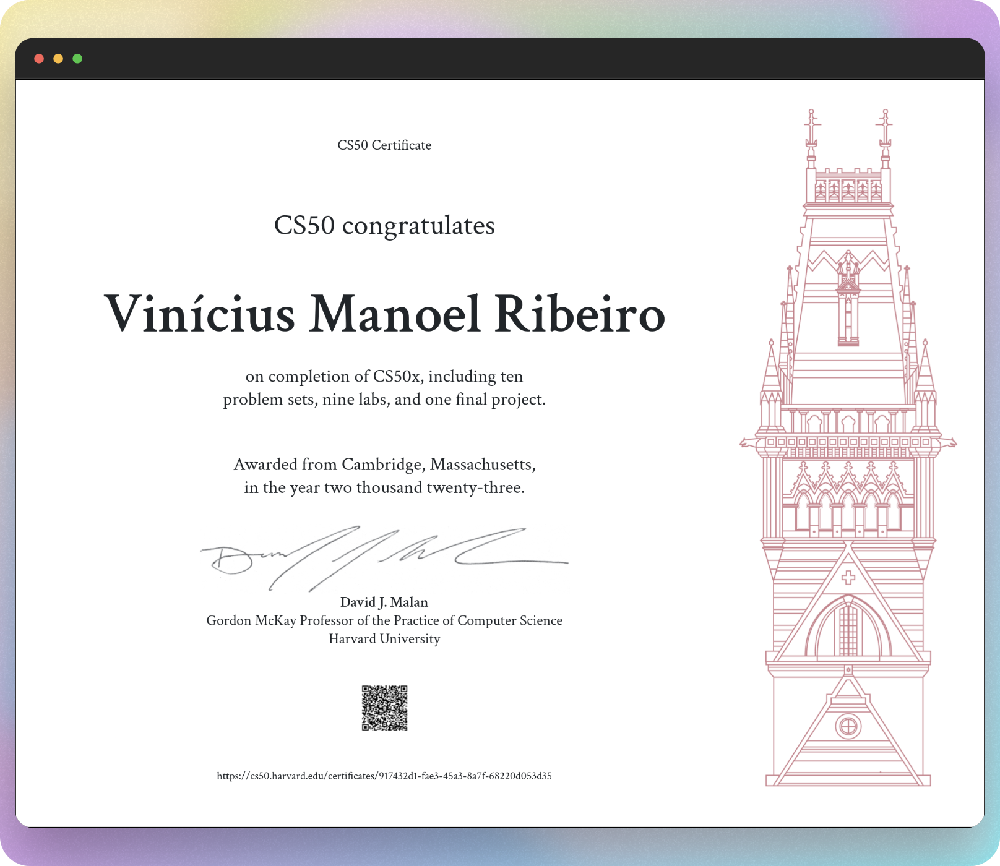

# Harvard CS50x 2023 Solutions 

This is CS50, Harvard University’s introduction to the intellectual enterprises of computer science and the art of programming, for concentrators and non-concentrators alike, with or without prior programming experience. (Two thirds of CS50 students have never taken CS before.) This course teaches you how to solve problems, both with and without code, with an emphasis on correctness, design, and style. Topics include computational thinking, abstraction, algorithms, data str…a which you’ll learn not only about functions, variables, conditionals, loops, and more, but also about how computers themselves work underneath the hood, memory and all. The course then transitions to Python, a higher-level language that you’ll understand all the more because of C. Toward term’s end, the course introduces SQL, via which you can store data in databases, along with HTML, CSS, and JavaScript, via which you can create web and mobile apps alike. Course culminates in a final project.

## Screenshots 🖼️

## Week 0 - Scratch 😺

Computer Science. Computational Thinking. Problem Solving: Inputs, Outputs. Representation: Unary, Binary, Decimal, ASCII, Unicode, RGB. Abstraction. Algorithms. Running Times. Pseudocode. Scratch: Functions, Arguments, Return Values; Variables; Boolean Expressions, Conditionals; Loops; Events; Threads.

- [Prairie King](https://scratch.mit.edu/projects/917174564/)

## Week 1 - C 👅

C. Source Code. Machine Code. Compiler. Correctness, Design, Style. Visual Studio Code. Syntax Highlighting. Escape Sequences. Header Files. Libraries. Manual Pages. Types. Conditionals. Variables. Loops. Linux. Graphical User Interface (GUI). Command-Line Interface (CLI). Constants. Comments. Pseudocode. Operators. Integer Overflow. Floating-Point Imprecision.

- [Credit](./week_1/hello/hello.c)
- [Debug](./week_1/debug/debug.c)
- [Half](./week_1/half/half.c)
- [Hello](./week_1/hello/hello.c)
- [Mario-more](./week_1/mario-more/mario.c)
- [Population](./week_1/population/population.c)
- [Prime](./week_1/prime/prime.c)

## Week 2 - Arrays 🔑

Preprocessing. Compiling. Assembling. Linking. Debugging. Arrays. Strings. Command-Line Arguments. Cryptography.

- [Caesar](./week_2/caesar/caesar.c)
- [Readability](./week_2/readability/readability.c)
- [Scrabble](./week_2/scrabble/scrabble.c)

## Week 3 - Algorithms 🧮

Searching: Linear Search, Binary Search. Sorting: Bubble Sort, Selection Sort, Merge Sort. Asymptotic Notation.

- [Plurality](./week_3/plurality/plurality.c)
- [Runoff](./week_3/runoff/runoff.c)
- [Sort](./week_3/sort/)

## Week 4 - Memory 💾

Pointers. Segmentation Faults. Dynamic Memory Allocation. Stack. Heap. Buffer Overflow. File I/O. Images.

- [Filter-less](./week_4/filter-less/)
- [Recover](./week_4/recover/)
- [Smiley](./week_4/smiley/)

## Week 5 - Data Structures 🧱

Abstract Data Types. Queues, Stacks. Linked Lists. Trees, Binary Search Trees. Hash Tables. Tries.

- [Inheritance](./week_5/inheritance/)
- [Speller](./week_5/speller/)

## Week 6 - Python 🐍

Python: Functions, Arguments, Return Values; Variables; Boolean Expressions, Conditionals; Loops. Modules, Packages.

- [DNA](./week_6/dna/)
- [Sentimental Credit](./week_6/sentimental-credit/)
- [Sentimental Hello](./week_6/sentimental-hello/)
- [Sentimental Mario More](./week_6/sentimental-mario-more/)
- [Sentimental Readability](./week_6/sentimental-readability/)
- [World Cup](./week_6/world-cup/)

## Week 7 - SQL 🏦

SQL: Tables; Types; Statements; Constraints; Indexes; Keywords, Functions; Transactions. Race Conditionals. SQL Injection Attacks.

- [Fiftyville](./week_7/fiftyville/)
- [Movies](./week_7/movies/)
- [Songs](./week_7/songs/)

## Week 8 - HTML, CSS, JavaScript 💻

Internet: Routers; TCP/IP; DNS. HTTP: URLs, GET, POST. HTML: Tags; Attributes. Servers. CSS: Properties; Selectors. Frameworks. JavaScript: Variables; Conditionals; Loops. Events.

- [Homepage](./week_8/homepage/)
- [Trivia](./week_8/trivia/)

## Week 9 - Flask 📲

Flask. Route. Decorators. Requests, Responses. Sessions. Cookies.

- [Birthdays](./week_9/birthdays/)
- [Finance](./week_9/finance/)

## Week 10 - Emoji 😁

Precision. Unicode: Emoji, Code Points, ZWJ.

## Final Project 📃

The climax of this course is its final project. The final project is your opportunity to take your newfound savvy with programming out for a spin and develop your very own piece of software. So long as your project draws upon this course’s lessons, the nature of your project is entirely up to you. You may implement your project in any language(s). You are welcome to utilize infrastructure other than the CS50 Codespace. All that we ask is that you build something of interest to you, that you solve an actual problem, that you impact your community, or that you change the world. Strive to create something that outlives this course.

Inasmuch as software development is rarely a one-person effort, you are allowed an opportunity to collaborate with one or two classmates for this final project. Needless to say, it is expected that every student in any such group contribute equally to the design and implementation of that group’s project. Moreover, it is expected that the scope of a two- or three-person group’s project be, respectively, twice or thrice that of a typical one-person project. A one-person project, mind you, should entail more time and effort than is required by each of the course’s problem sets.

- [Project](./project/)
- [Deploy](https://shortlinks-vncsmnl.vercel.app/)

## CS50 Certificate 📑

## License 📝

A short and simple permissive license with conditions only requiring preservation of copyright and license notices. Licensed works, modifications, and larger works may be distributed under different terms and without source code.

